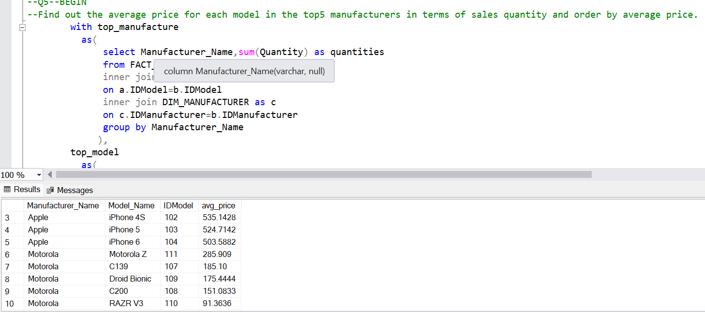
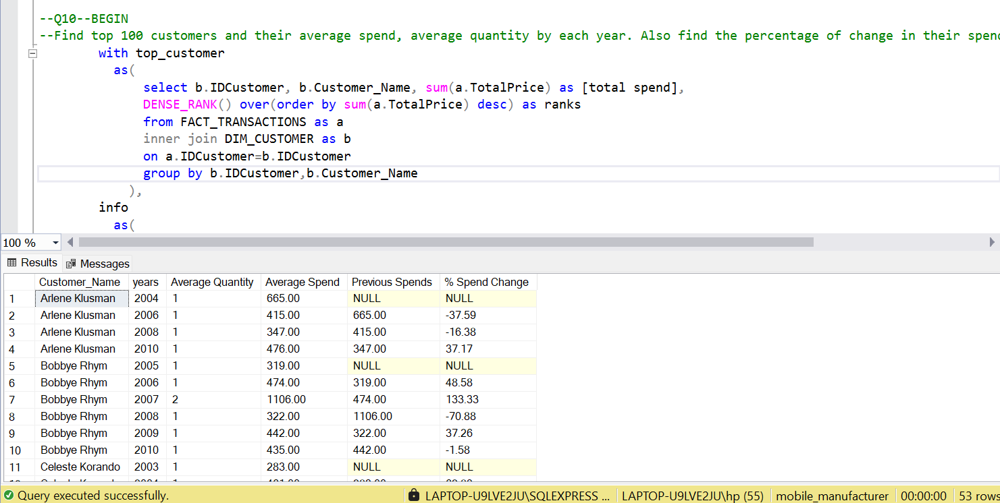

# 🛍️ Retail Data Analysis using SQL

This project involves exploring and analyzing retail transaction data using SQL to derive insights into customer behavior, product performance, and sales trends.

---

## 📌 Objective

To perform data-driven analysis on a retail dataset using SQL by writing queries to answer key business questions and generate actionable insights for decision-making.

---

## 🧰 Tools & Technologies

- SQL (MySQL / PostgreSQL / any RDBMS)
- DBMS for query execution
- Excel (for data review, optional)

---

## 📂 Project Structure
```
SQL - Retail data analysis/
│
├── Answer_Template.sql # SQL queries answering the case study questions
├── Customer.csv # Customer-level data
├── Transactions.csv # Transactional data including purchase details
├── prod_cat_info.csv # Product category and sub-category mapping
└── outputs
        └── plots
```


---

## 🧠 Key Analysis Performed

- Total revenue and order counts
- Most profitable categories and sub-categories
- Customer-wise total spend
- Monthly sales trends
- Payment type analysis
- Top-selling products and categories

---

## 🚀 How to Run

1. Import all `.csv` files into your SQL environment as tables.
2. Use the queries in `Answer_Template.sql` to run the analysis step by step.
3. You can visualize the results in any BI tool like Power BI, Excel, or Tableau (optional).

---

## 📸 Screenshot

To include visual proof of your results (e.g., table previews or SQL output), save a screenshot and place it in an `outputs/` folder:







## 📌 Author

**Abhishek Bhardwaj** 

[Linkedin Link](https://www.linkedin.com/in/abhishekbhardwaj28)  |  [GitHub Link](https://github.com/abhishek-9617)
